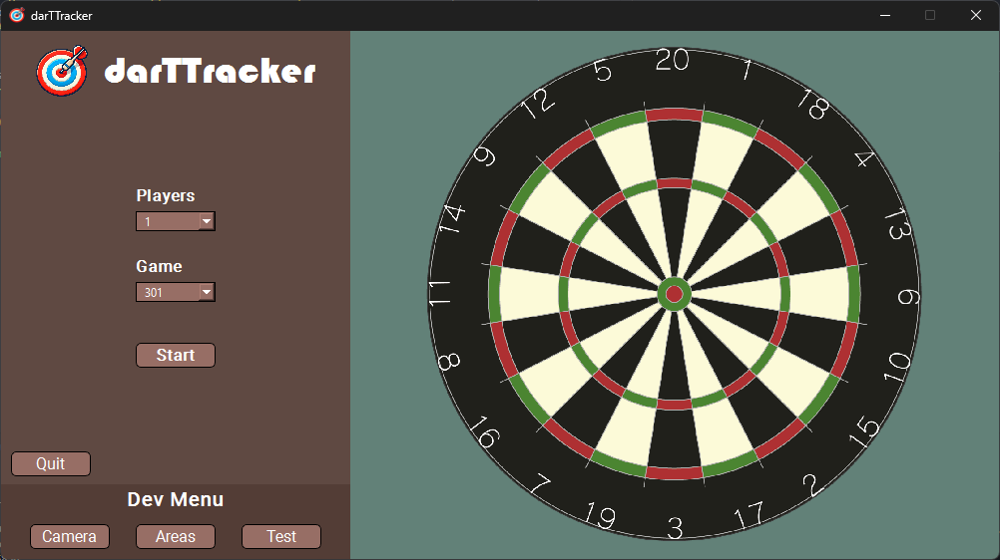
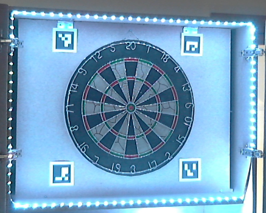

# **darTTracker 🎯** | In Contruction...

## **Description**  
This repository is a personal project developed for personal use. It is an automatic dart scoring application that uses a single webcam, inspired by the [Darts_Project](https://github.com/LarsG21/Darts_Project/tree/master). The app supports up to 6 players and offers 3 game modes: 301, 501, and 701.

<p align="center">
  
</p>

## **Setup**
### **Hardware**
- Four [ArUco Markers](arucoMarkers)
- Webcam
- Some Sort of Tripod
- Computer
- Dartboard
- Led Strip\Light Diffuser
- White Darts (for better detection)

1. Position the webcam at a distance from the dartboard, slightly to the left.
2. Place the ArUco markers and LED strip/light diffuser as shown in the image below.
3. Adjust the angle and dartboard areas using the _Camera_ and _Areas_ buttons in the Dev Menu, and test the setup using the _Test_ button.

<p align="center">
  
</p>

### **Software**
Clone the repository and install the necessary [packages](packages.txt):
```bash
pip install -r packages.txt
```

## **Instructions**  
1. Select the number of players  
2. Choose the desired game mode  
3. Enjoy the game 🎯  

## **Author**  
- [@Luís Abrantes](https://github.com/abrantessss)

## **Licence**  
This project is licensed under the [MIT Licence](LICENSE).
